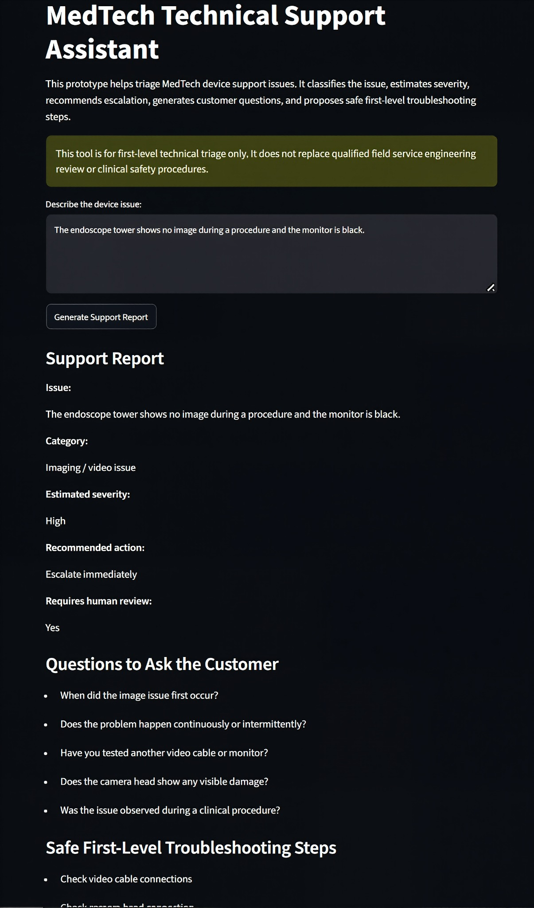

# MedTech Technical Support Assistant

A prototype technical support triage tool for MedTech device issues, built with Python and Streamlit.

This project demonstrates how domain-specific support logic can be structured into a simple web application for first-level device issue triage.

## Version

Stable release: `v1.3`

Live demo:

https://medtech-ai-support-agent-v1.streamlit.app

## Purpose

MedTech technical support teams often need to quickly collect issue details, assess urgency, ask the right follow-up questions, and decide whether escalation is required.

This prototype supports that workflow by taking a device issue description and generating a structured support report.

## What the app does

The app currently provides:

- device type selection
- issue classification
- severity estimation
- escalation recommendation
- human review flag
- customer follow-up questions
- safe first-level troubleshooting steps
- copyable internal service note
- downloadable support report as a `.txt` file
- service-ticket dashboard
- synthetic service-ticket dataset
- operational metrics for support tickets
- charts by device type, severity, and human review requirement

## Example use case

Input:

```text
Device type: Endoscope tower

Issue: The monitor is black during a procedure.
```

Expected output:

```text
Category: Imaging / video issue
Estimated severity: High
Recommended action: Escalate immediately
Requires human review: Yes
```

The app also generates customer questions and safe first-level troubleshooting steps.

## Screenshot



## Tech stack

- Python
- Streamlit
- pandas
- Rule-based triage logic
- GitHub Codespaces for development
- Streamlit Community Cloud for deployment

## Project structure

```text
medtech-ai-support-agent/
├── app.py
├── medtech_assistant.py
├── requirements.txt
├── README.md
├── app_screenshot.png
├── data/
│   └── service_tickets.csv
└── .gitignore
```

## Files

### `app.py`

Streamlit web application. Handles the user interface, device type dropdown, issue text input, report display, internal service note, and report download.

### `medtech_assistant.py`

Core triage logic. Includes issue classification, severity estimation, escalation logic, customer questions, and troubleshooting step generation.

### `requirements.txt`

Python dependencies required to run the app.

## Safety note

This tool is for first-level technical triage only.

It does not replace:

- qualified field service engineering review
- manufacturer service procedures
- clinical judgement
- biomedical engineering assessment
- regulatory safety processes

For high-severity issues, clinical workflow disruption, patient safety concerns, laser output issues, or device failure during a procedure, the app flags the case for human review and escalation.

## Current limitations

This version is intentionally simple.

Current limitations include:

- rule-based keyword logic
- no manufacturer-specific documentation retrieval
- no validation against actual service manuals
- no integration with ticketing systems
- no user authentication
- no audit trail
- no regulated clinical or engineering approval workflow

## Planned future improvements

Potential future upgrades:

- LLM-generated professional support responses
- document retrieval from manuals and service documentation
- more advanced severity scoring
- structured escalation pathways
- report export in PDF format
- service-ticket dashboard
- human approval workflow
- integration with CRM or service-ticket systems

## Development workflow

The stable version is maintained on the `main` branch.

New features are developed on separate feature branches and reviewed through pull requests before being merged into `main`.

Current feature branch:

```text
feature-device-dropdown-download
```

## Release history

### v1.0

Initial stable version.

Features:

- Streamlit web app
- rule-based issue classification
- severity estimation
- escalation recommendation
- human review flag
- customer questions
- safe first-level troubleshooting steps
- copyable internal service note

### v1.1

Added:

- device type dropdown
- structured report generation using device type and issue description
- downloadable support report
- improved internal service note formatting

### v1.2

Stable release.

Added:
- device-aware triage logic
- device type now influences classification
- device type now influences severity estimation
- device type now influences human review flag
- device-specific customer questions
- device-specific troubleshooting steps

### v1.3

Stable release.

Added:

- service-ticket dashboard tab
- synthetic service-ticket dataset
- total ticket count metric
- high-severity ticket count metric
- open ticket count metric
- average resolution time metric
- charts by device type, severity, and human review requirement
- service-ticket data table
- pandas dependency

## Author

Nikolay Lipey

PhD physicist with experience in MedTech, optical engineering, biomedical imaging, technical application support, and applied AI workflow development.

LinkedIn:

https://www.linkedin.com/in/nikolaylipey
